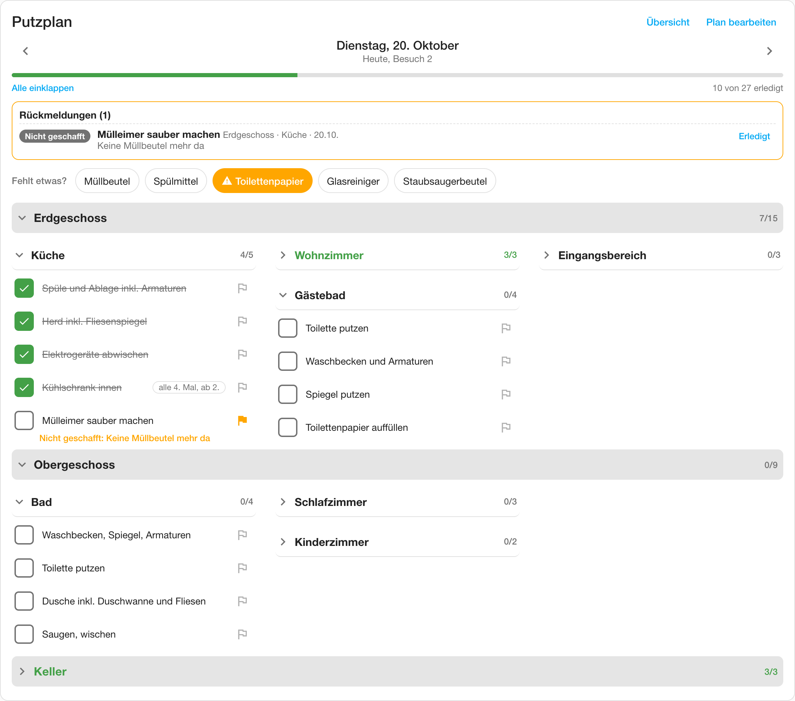
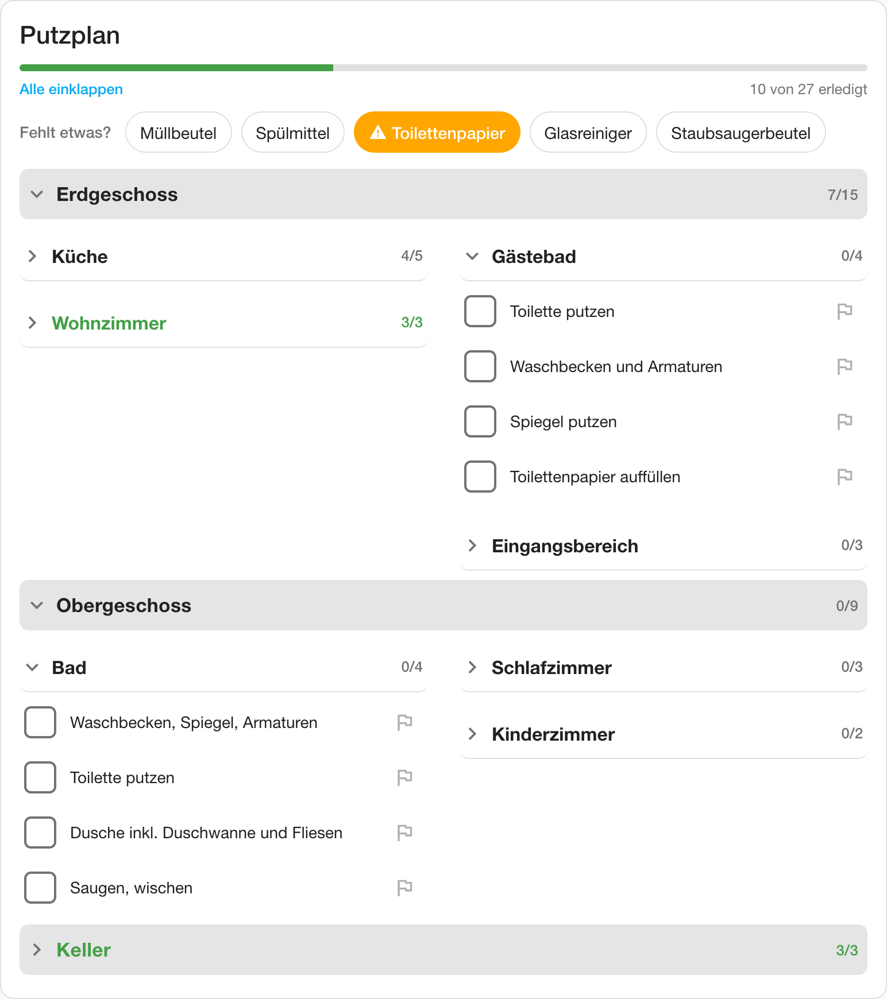
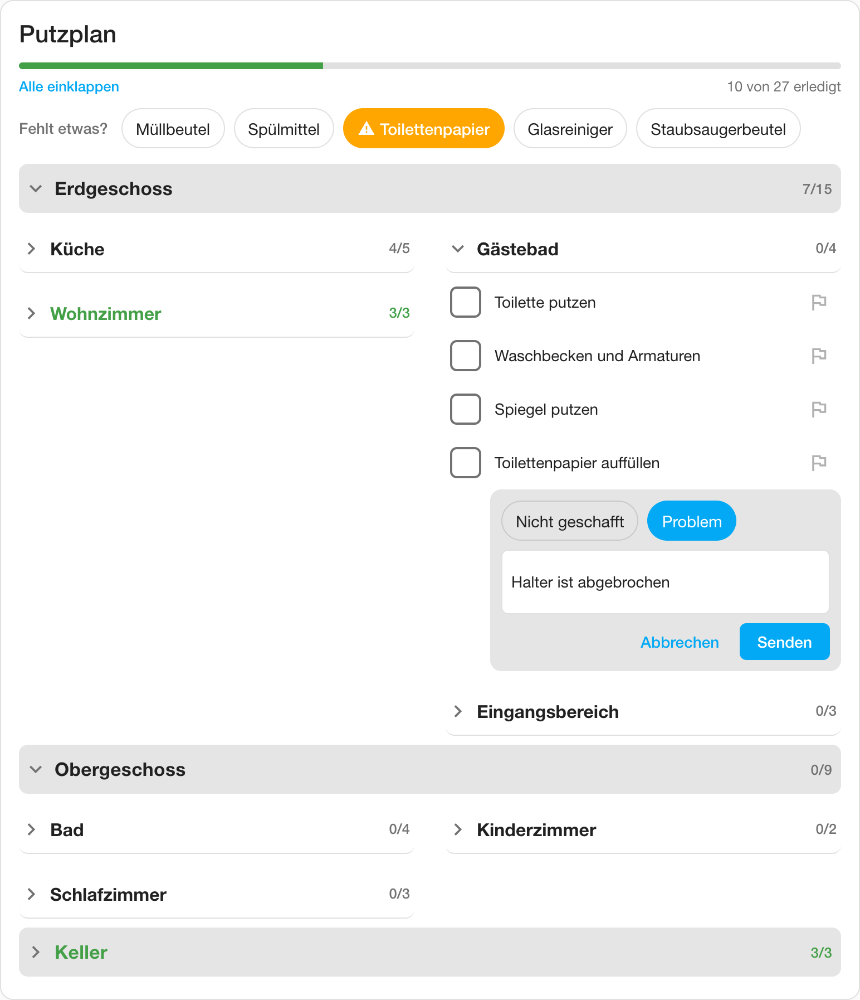
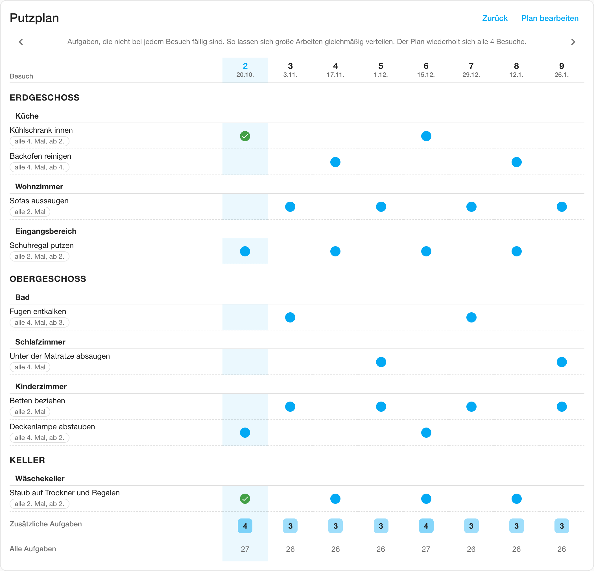
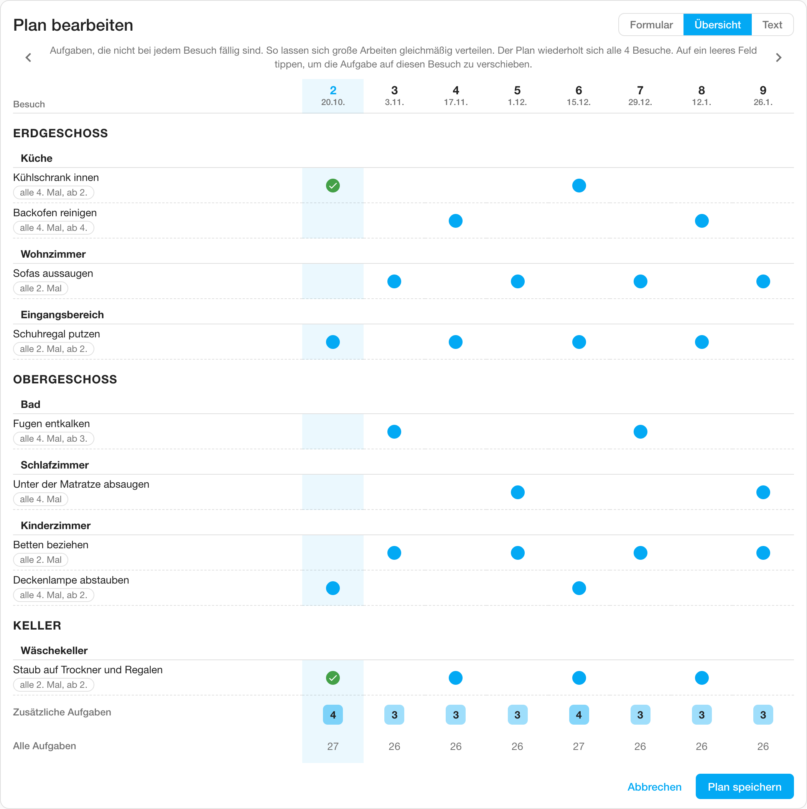
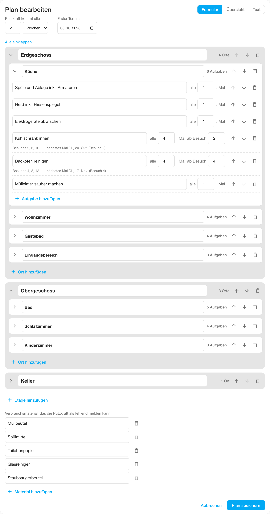
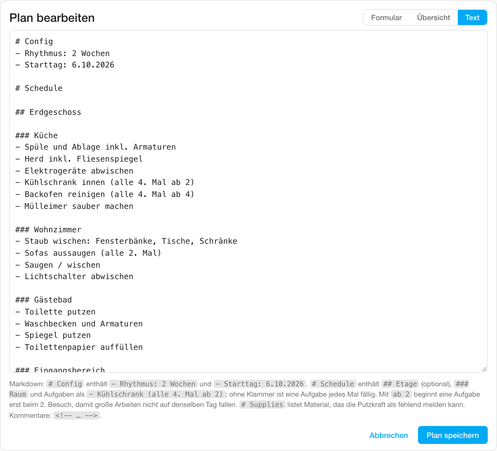

# Cleaning plan for Home Assistant

A custom integration for a cleaner who comes on a fixed rhythm, for example every 2 weeks. The household writes the plan in a dashboard card, in a form or as Markdown. On cleaning day the cleaner sees the tasks due on that visit, grouped by location, and ticks them off.

The cleaner can report missing supplies and problems with a task. The integration stores the plan, the ticks and this feedback itself. It adds a calendar with one event per visit, sensors for the next visit and its progress, services for automations, and a Lovelace card that is loaded automatically.



| Cleaner's tablet | Cleaner reports a problem |
| --- | --- |
|  |  |

| Schedule overview | Overview tab in the editor |
| --- | --- |
|  |  |

| Editing in the form | Editing as Markdown |
| --- | --- |
|  |  |

## Installation

**HACS.** Add this repository as a custom repository of type Integration, install "Cleaning plan", and restart Home Assistant.

**Manual.** Copy `custom_components/cleaning_plan/` into `config/custom_components/` and restart Home Assistant.

Then go to Settings > Devices & services > Add integration > Cleaning plan. Enter a name. Each entry is one plan, so a second house gets a second entry.

There is no resource to register. The integration serves the card and adds it to every dashboard, with its version in the URL so browsers pick up updates by themselves.

## The card

```yaml
# Household view: editing, visit navigation, frequency labels
type: custom:cleaning-plan-visit-card

# Cleaner's tablet: tick-off only
type: custom:cleaning-plan-visit-card
allow_edit: false
```

The card also has a visual editor. Find it as "Cleaning plan" in the card picker.

| Option | Default | Description |
| --- | --- | --- |
| `entry_id` | first plan | Which plan to show. Only needed with more than one plan |
| `title` | the plan's name | Card heading |
| `allow_edit` | `true` | `false` gives the cleaner view. It shows only the progress and the tasks of the current visit, with no date, no due line, no visit number, no arrows, no frequency labels, no overview and no Edit plan button |
| `column_width` | `300` | Minimum width in px of one location column. Locations flow into as many columns as fit |

How the card behaves:

- **Floors.** With floors in the plan, each floor gets a header with its done count, and its locations are listed below it. A floor folds by itself when all its tasks are done, and a tap on the header opens or closes it.
- **Locations start folded.** Each header shows its name and how many tasks are ticked. Tap to open. A location folds again when its last task is ticked. "Collapse all" / "Expand all" sits above the list.
- **Width.** In a sections view the card asks for the full row width. In a masonry view, use a panel view for a wide card.
- **Language and dates** follow the user's Home Assistant profile. German and English are built in, other languages fall back to English.
- **Live updates.** Ticks from another device appear immediately. The card gets pushed updates instead of polling.
- **Editor.** "Edit plan" opens the editor with three tabs: Form, Overview and Text. All three show the same plan.

### Feedback from the cleaner

- **Missing supplies.** Supplies from the plan's `# Supplies` section show as chips under "Fehlt etwas?" in both views. One tap marks a supply as missing, shown in orange. Another tap clears it, for example once it's bought. A missing supply can also be added to a to-do list automatically, see [Options](#options).
- **Problems on a task.** Each task has a flag button. The cleaner chooses "Nicht geschafft" or "Problem", adds an optional note and sends it. The flag turns orange and the note shows under the task. Tapping the flag again opens the report to change it or withdraw it.
- **Household view.** A "Rückmeldungen" box above the list shows all open problem reports, also from earlier visits, newest first. "Erledigt" removes a report.
- **Notifications.** Every report fires an event, see [Events](#events).

### Schedule overview

In the household view, "Overview" next to "Edit plan" opens a table of the tasks that are not due on every visit. The editor has the same table as a third tab.

- **Columns** are visits, with visit number and date. The current visit is highlighted and past visits are dimmed. The table shows at least one full repeat cycle of the plan, between 8 and 16 visits. The arrows page through further visits.
- **Rows** are the irregular tasks, grouped by floor and location, with their frequency. A dot marks each visit where a task is due, and a green check marks a visit where it was done.
- **Load rows.** "Extra tasks" counts the irregular tasks per visit, shaded darker on heavy visits. "All tasks" counts everything due. Use them to see whether big jobs pile up on the same visit.
- **Moving a task in the editor.** In the editor tab the table follows unsaved changes. Tapping an empty cell moves that task's turn to this visit, keeping its interval. The change is saved with "Save plan".

The cleaner view has no overview.

### Editing the plan in the form

- **Settings.** At the top you set how often the cleaner comes, in weeks or days, and the date of the first visit.
- **Floors.** "Add floor" at the bottom turns on floors. Each floor is a box holding its locations, with its name, a location count, arrows to reorder and a bin to delete it. When you add the first floor, the existing locations stay in an unnamed box at the top. Give it a name, or leave it unnamed for locations without a floor. Only this first box may stay unnamed.
- **Locations.** Locations are foldable boxes. Type the name, and the header shows how many tasks the location has. Arrows move a location up or down. Past the first or last location of a floor, it moves to the neighbouring floor. The bin deletes a location after asking.
- **Tasks.** Each task has a name and "every N. visit". When N is more than 1, a "starting with visit" field appears. Below the task you see its visit numbers and the date it is next due, so you can spread heavy jobs across visits.
- **Fast entry.** Enter in a location name jumps to its first task. Enter in a task adds the next one. Empty tasks are ignored when saving.
- **Checks.** Duplicate or invalid names, a missing start day and invalid numbers are flagged at the field. Save stays disabled until they are fixed.
- **Renames keep ticks.** Renaming a task, location or floor in the form, or moving a location to another floor, moves its existing ticks along.
- **Text tab.** Shows the same plan as text, checked on the server as you type. You can only switch back to the form when the text has no errors.
- **Comments.** Saving from the form writes the plan text in your profile language and removes `<!-- … -->` comments. The form warns about this when the plan has comments. Use the Text tab to keep them.

## Plan format

The plan is Markdown. The form in the card writes it for you, so you only need this for the Text tab and the `set_plan` service.

```markdown
# Config
- Rhythmus: 2 Wochen
- Starttag: 6.10.2026

# Schedule

## Erdgeschoss

### Küche
- Arbeitsflächen, Herd und Spüle
- Mikrowelle innen (alle 2. Mal)
- Kühlschrank innen (alle 4. Mal ab 2)

<!-- Kommentar -->

## Obergeschoss

### Bad
- Toilette, Waschbecken, Dusche

# Supplies
- Müllbeutel
- Toilettenpapier
```

| Line | Meaning |
| --- | --- |
| `# Config` | Settings section. `# Einstellungen` also works |
| `- Rhythmus: N Wochen` / `- rhythm: N weeks` | Days between visits. A unit starting with "d" or "t" (days, Tage) means days, anything else means weeks. Default is 2 weeks. The bullet is optional |
| `- Starttag: 6.10.2026` / `- start day: 2026-10-06` | Date of visit 1. Required |
| `# Schedule` | Tasks section. `# Putzplan` also works |
| `## name` | A floor. Optional. Rooms before the first floor heading have no floor |
| `### name` | A room. Every task needs a room above it |
| `- name` | A task due on every visit. `*` and `+` also work as bullets |
| `- name (alle N. Mal)` / `(every N. time)` | Due on visits 1, 1+N, 1+2N, … |
| `- name (alle N. Mal ab S)` / `(every N. time from S)` | Due on visits S, S+N, S+2N, … Use this to spread heavy tasks across visits |
| `# Supplies` | Optional. List items are supplies the cleaner can report as missing. `# Vorräte` and `# Material` also work |
| `<!-- … -->` | Comment, also over several lines |

English and German keywords can be mixed. Only a trailing parenthesis that is a frequency counts. In "Fenster (innen)" the parenthesis stays part of the name, and colons in names are fine.

The parser is strict and reports errors with line numbers for:

- text outside `# Config` and `# Schedule`
- unknown sections or settings
- headings deeper than `###`
- tasks without a room
- lines in the schedule that aren't tasks

The same location name may appear on several floors, for example "Bad" on both floors. Each one has its own tasks and ticks.

## Entities

Each plan is a device with three entities:

| Entity | State | Attributes |
| --- | --- | --- |
| Calendar "Visits" | on during a visit day | One all-day event per visit. The description lists the due tasks by location |
| Sensor "Next visit" | date of today's visit on a cleaning day, else the next one | `visit`, `days_until`, `tasks_due` |
| Sensor "Progress" | % of the current visit's tasks ticked | `visit`, `date`, `ticked`, `open`, `total` |

All three switch to the next visit at midnight after a cleaning day, in the Home Assistant time zone.

## Services

| Service | What it does |
| --- | --- |
| `cleaning_plan.set_plan` | Replaces the plan text. Rejected if the text has errors |
| `cleaning_plan.set_task_done` | Ticks or unticks a task. Give `floor` for locations on a floor. `date` defaults to the current visit. Fails if the task isn't due then |
| `cleaning_plan.get_visit` | Returns the due tasks of a visit with tick state. `offset: 1` is the visit after the current one |

Example: a reminder on the evening before a visit, listing what's due. Replace the sensor with your plan's "Next visit" sensor. Its entity ID depends on the plan name and the server language. Take the entry ID from the URL of the integration entry, or pick the plan in the action editor.

```yaml
triggers:
  - trigger: time
    at: "19:00:00"
conditions:
  - condition: state
    entity_id: sensor.putzplan_next_visit
    attribute: days_until
    state: 1
actions:
  - action: cleaning_plan.get_visit
    data:
      config_entry_id: YOUR_ENTRY_ID
    response_variable: visit
  - action: notify.notify
    data:
      title: "Putzen morgen: {{ visit.total }} Aufgaben"
      message: >
        {{ loc.name }}: {{ loc.tasks | map(attribute='name') | join(', ') }}
        
```

## Events

`cleaning_plan_feedback` is fired when the cleaner reports something and when it is cleared. `data.type` says what happened:

| `type` | Further data |
| --- | --- |
| `supply_missing`, `supply_available` | `supply` |
| `task_problem` | `id`, `date`, `floor`, `location`, `task`, `kind` (`skipped` or `issue`), `note` |
| `problem_resolved` | `id`, `date`, `floor`, `location`, `task` |

All events also carry `entry_id`. Example: a push notification for every report.

```yaml
triggers:
  - trigger: event
    event_type: cleaning_plan_feedback
    event_data:
      type: task_problem
actions:
  - action: notify.notify
    data:
      title: "Putzen: {{ trigger.event.data.task }}"
      message: >
        {{ 'Nicht geschafft' if trigger.event.data.kind == 'skipped' else 'Problem' }}
        in {{ trigger.event.data.location }}: {{ trigger.event.data.note or '-' }}
```

## Options

Settings > Devices & services > Cleaning plan > Configure:

| Option | Default | Description |
| --- | --- | --- |
| Keep ticks for | 60 days | Ticks and problem reports of older visits are deleted at midnight. Missing supplies don't expire |
| Add missing supplies to | none | A to-do list, for example the shopping list. A supply the cleaner reports as missing is added there, unless an open item with the same name exists. Clearing it in the card doesn't change the list |

## How it works

- **Storage.** `.storage/cleaning_plan.<entry_id>` holds the plan text and, per visit date, the ticked `[floor, location, task]` entries. Floor is `""` for locations without a floor. It also holds the missing supplies and the open problem reports. Problem reports follow renamed tasks like ticks do.
- **Ticks are keyed by names.** Renaming a task or location, or changing the start day or rhythm, un-ticks it for the current visit.
- **No carry-over.** A task that isn't ticked off reappears at its next regular turn.
- **Permissions.** Any logged-in user can tick and edit. `allow_edit: false` only hides the editor in that card.

Websocket commands used by the card:

| Command | Purpose |
| --- | --- |
| `cleaning_plan/plans` | List loaded plans |
| `cleaning_plan/subscribe` | Push plan, ticks and today's date now and on every change. Sends `{"reload": true}` when the entry unloads |
| `cleaning_plan/validate` | Parsed plan and errors for a plan text, as `{code, line}` pairs, without saving |
| `cleaning_plan/save_plan` | Save if valid. Optional `renames`, as `[{from: [floor, location, task], to: [floor, location, task]}]`, move ticks. Returns `{saved, errors}` |
| `cleaning_plan/set_done` | Tick or untick one task of one visit. `floor` defaults to `""` |
| `cleaning_plan/set_supply_missing` | Report a supply from the plan as missing or available |
| `cleaning_plan/report_problem` | Report `skipped` or `issue` with an optional note, up to 500 characters, for a task due on that visit. Replaces an earlier report for the same task and visit |
| `cleaning_plan/resolve_problem` | Remove a problem report by `problem_id` |

## Development

```bash
uv sync                                   # Python 3.13+, HA test harness, reportlab for the PDF
uv run pytest                             # integration and parser tests
cd tests/frontend && npm install && npm test   # card smoke tests in jsdom
cd tests/frontend && npm run screenshots         # regenerate docs/screenshots with headless Chrome
```

| Path | Purpose |
| --- | --- |
| `custom_components/cleaning_plan/plan.py` | Parser and visit math. No Home Assistant imports |
| `custom_components/cleaning_plan/manager.py` | Storage, ticks, midnight rollover, change listeners |
| `custom_components/cleaning_plan/websocket_api.py` | Commands used by the card |
| `custom_components/cleaning_plan/frontend/cleaning-plan-card.js` | The card, vanilla JS, no build step |
| `putzplan.txt` | The household plan, ready to paste into the Text tab |

Notes for changes:

- Bump `version` in `manifest.json` and `CARD_VERSION` in the card together. A test checks they match.
- The screenshots use the demo plan in `tests/fixtures/demo_plan.md`, parsed by the integration's own parser. Set `CHROME_PATH` if Chrome is not in the default macOS location.
- `tests/fixtures/form_*.txt` is the exact text the form writes. The card tests compare against it and the Python tests parse it, which keeps the card's writer and the server's parser in step.
- Home Assistant 2026.x validates with probatio instead of voluptuous. `util.py` imports whichever is available.
- Parser error codes are translated in the card's `STRINGS`. A new code needs an entry there in every language.
